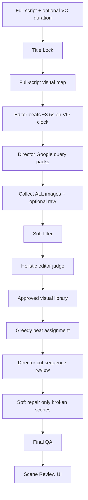

# Documentary AI Director — how visual selection works

This is the Celebrity / Mystery / Space brain. The AI acts as a **director**, not a keyword spam bot: understand the film first, search with intent, collect everything, judge the pool together, cut the sequence, and only repair what is actually wrong.

## End-to-end flow

### 1) Understand the film (before any Google search)

| Stage | What it decides |
|-------|-----------------|
| **Title Lock** | Main subject, emotional promise, expected visuals, forbidden drift |
| **Visual map** | Exact people / places / objects / documents / discoveries across the *whole* script |
| **Global context** | Confusing same-name entities, forbidden entities, tone |

Celebrity now uses the same pre-search brain as Mystery (identity-first niche rules).

### 2) Beats on the voice clock

Narration is split into ~3–5 second meaning windows stretched to `voiceoverDurationSec` (ffprobe) or a 150 WPM estimate.

This is **not** Whisper word-alignment yet — cuts follow VO *duration* and script word share so the film length matches audio. Whisper can be added later to snap beat boundaries to spoken words without changing search logic.

### 3) How search queries are selected

`createDirectorQueryPacks` asks GPT to write **Google Image packs**, not random keywords.

**Celebrity**
- Full correct name in every serious query
- `{Name} red carpet`, `{Name} interview`, `{Name} {event/year}`, couple queries when narration needs them
- Disambiguators when `confusingSimilarEntities` exist
- Atmosphere still tied to the person/world — not random lifestyle stock

**Mystery**
- Evidence first: exact place, artifact, map, document, discovery
- Literal narration match: cave→cave, stone door→doorway/archaeology, researchers→field/lab
- Allows serious dramatic news/blog stills; forbids horror/meme/thumbnail text

Packs are:
1. Grouped by shared visual subject across related beats
2. Prioritized (exact identity/evidence 90–100 → atmosphere 50–69)
3. Deduped and capped by job duration budgets
4. Local niche-aware fallbacks if GPT is skipped (no more Mystery→“royal family” drift)

### 4) Collect everything first

For each pack we pull Google Images (SearchAPI) + optional Pexels + optional raw/YouTube clips.

**Important:** we do **not** judge image-by-image while searching. The full candidate pool is built first so the editor can compare options.

Soft filter removes obvious junk (stock watermark hosts, meme titles, true portrait when dimensions exist). **Missing Google dimensions no longer kill candidates** — they pass with crop-review.

### 5) Holistic AI judge (the pool together)

One editor pass sees titles, queries, entities, beat roles, and niche rules.

Gates are **firm on wrong entity / watermark**, softer on aesthetic perfection:
- Approve around editor score ≥ ~68 with reasonable title/narration support
- Reserve path can keep useful ~60+ visuals for timeline choice
- Goal: don’t starve the cut with 85/75 perfection floors

Approved visuals become the **library** the director must cut from.

### 6) Place according to script (+ raw mix)

Greedy assignment scores each library visual per beat (narration, title, exact subject, raw boost for atmosphere).

Optional user YouTube raw targets ~20% duration (quality-reduced). Uploaded raw keeps the older ~30–40% band.

### 7) Director cut (sequence intelligence)

After the greedy pass, GPT reviews the **whole sampled timeline** vs title lock + library and may swap up to ~22% of scenes — **only** when something is wrong/weak/repetitive and a better library visual exists. Good-enough stays.

### 8) Soft repair — only if something is wrong

Broken scenes only (`needs_better`, empty, high wrong-context, weak identity on main_subject/evidence):
1. Prefer a better library alternate
2. Else one targeted Google query for that beat’s exact subject
3. Cap repairs (~8% of scenes) so cost stays sane

No full re-pipeline. No perfectionist re-search of healthy scenes.

### 9) Final QA → Scene Review

Critical blocks: missing visuals, clearly wrong, confidence collapse.  
`needs_better` is a review flag, not an automatic render death sentence.

Human Scene Review remains the last creative gate; **Find better** now picks the **best-scored** library alternate, not `alternatives[0]`.

---

## Design principles (why this helps you)

1. **Director > keyword bot** — understand promise before searching  
2. **Collect then judge** — compare a pool, don’t greedily lock early  
3. **Strict where it hurts (wrong face/place), soft where it starved you (scores/aspects)**  
4. **Sequence pass** — story flow after per-beat picks  
5. **Repair only damage** — don’t “improve” a good cut into oblivion  

## Key files

| Piece | Path |
|-------|------|
| Entry | `server/visualIntelligence/pipeline.ts` |
| Director pipeline | `server/visualIntelligence/director/directorPipeline.ts` |
| Query brain | `server/visualIntelligence/director/directorQueries.ts` |
| Sequence cut | `server/visualIntelligence/director/directorCut.ts` |
| Soft repair | `server/visualIntelligence/director/softRepair.ts` |
| Editor judge | `server/visualIntelligence/editorJudge.ts` |
| Timeline assemble | `server/visualIntelligence/assembleEditorTimeline.ts` |
